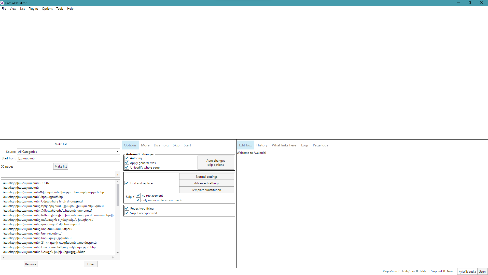

# **This project is under construction. You are free to contribute but don't use the app just** yet.

## CrossWikiEditor

This project aims to recreate [AutoWikiBrowser](https://en.wikipedia.org/wiki/Wikipedia:AutoWikiBrowser) using .NET 7 and [AvaloniaUI](https://avaloniaui.net/). This will make future improvements much easier and most importantly, it will work on Linux distributions without the Wine compatibility layer.

Latest builds: https://drive.google.com/drive/folders/1c4CnqaQQFjeTcd6ydpBPLAsVQ-YgPNYa

# Available list sources
* All Categories
* All Files
* All Pages
* All Pages (no redirects)
* All Pages with prefix (Prefixindex)
* All Redirects
* All Users
* Categories on page
* Categories on page (no hidden categories)
* Categories on page (only hidden categories)
* Category
* Category (recursive 1 level)
* Category (recursive user defined level)
* Category (recursive)
* Disambiguation pages
* Files on page
* Google search
* HTML Scraper
* Image file links
* Link search
* Links on page
* Links on page (only bluelinks)
* Links on page (only bluelinks)
* My watchlist
* New pages
* Pages with a page property
* Pages without language links
* Pages without language links (no redirects)
* Petscan
* Protected pages
* Random pages
* Recent Changes
* Text file
* Transclusions on page
* User contribs
* What links here
* What transcludes page
* What transcludes page (all NS)
* Wiki search (text)
* Wiki search (text) (all NS)
* Wiki search (title)
* Wiki search (title) (all NS)