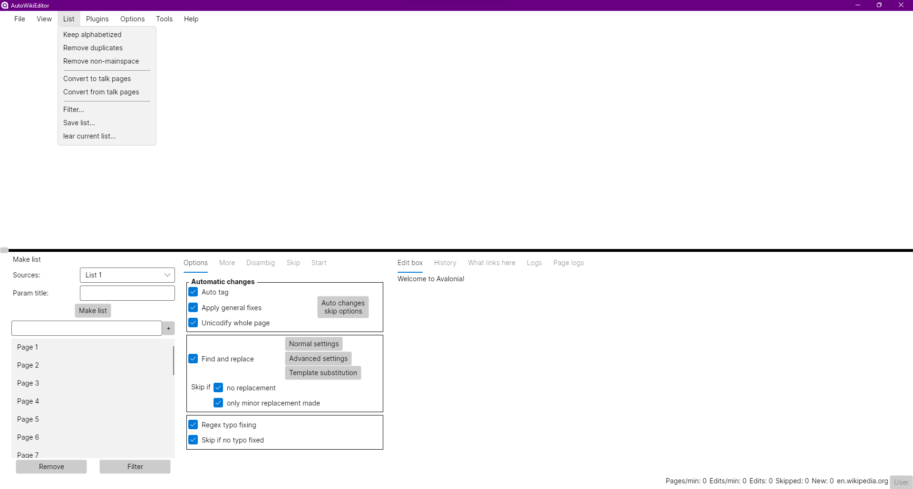

# CrossWikiEditor

This project aims to recreate [AutoWikiBrowser](https://en.wikipedia.org/wiki/Wikipedia:AutoWikiBrowser) using .NET 6 and [AvaloniaUI](https://avaloniaui.net/). This will make future improvements much easier and most importantly, it will work on Linux distributions without the Wine compatibility layer.

