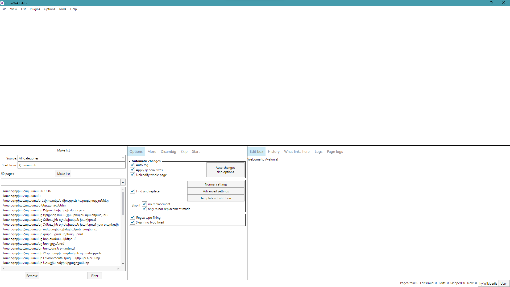

# The project is still in the works, and I'd love your contributions. However, I recommend holding off on using the app for now. Thanks for your understanding!

## CrossWikiEditor

Hey there! I'm working on creating a cross-platform version of [AutoWikiBrowser](https://en.wikipedia.org/wiki/Wikipedia:AutoWikiBrowser). I'm using [AvaloniaUI](https://avaloniaui.net/) for the user interface and [WikiClientLibrary](https://github.com/CXuesong/WikiClientLibrary) to connect with the MediaWiki API. The goal is to make it run seamlessly on Windows, Linux, and OSX (without needing Wine).

Latest builds: https://drive.google.com/drive/folders/1c4CnqaQQFjeTcd6ydpBPLAsVQ-YgPNYa

# Available list sources
* All Categories
* All Files
* All Pages
* All Pages (no redirects)
* All Pages with prefix (Prefixindex)
* All Redirects
* All Users
* Categories on page
* Categories on page (no hidden categories)
* Categories on page (only hidden categories)
* Category
* Category (recursive 1 level)
* Category (recursive user defined level)
* Category (recursive)
* Database dump
* Disambiguation pages
* Files on page
* HTML Scraper
* Image file links
* Link search
* Links on page
* Links on page (only bluelinks)
* Links on page (only redlinks)
* My watchlist
* New pages
* Pages with a page property
* Pages without language links
* Pages without language links (no redirects)
* Petscan
* Protected pages
* Random pages
* Recent Changes
* Text file
* Transclusions on page
* User contribs
* What links here
* What transcludes page
* What transcludes page (all NS)
* Wiki search (text)
* Wiki search (text) (all NS)
* Wiki search (title)
* Wiki search (title) (all NS)
